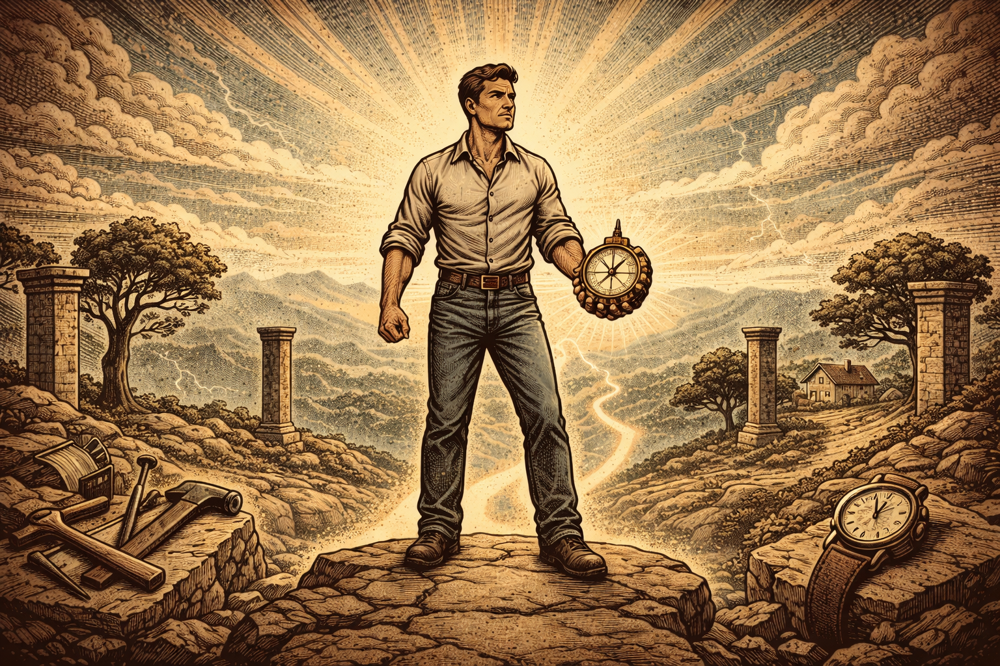

He did not notice the first time he crossed his own line.

It was small. A promise pushed to next week. A truth softened to avoid tension. A standard adjusted because the moment felt inconvenient. Nothing dramatic. No public collapse. Just a quiet trade.

Over time, the trades stacked.

He still saw himself as disciplined. He still talked about what mattered to him. But his days told a different story. He said family came first, yet work took every spare hour. He claimed honesty, yet avoided hard conversations. He valued growth, yet repeated the same habits.

The conflict did not show up as crisis. It showed up as friction. Decisions felt heavier than they should. Anger flared over small things. Pride became rare. Something inside felt off, though he could not name it.

Most men call this stress. Or burnout. Or lack of motivation.

It is not.

## The Real Problem Is Not Discipline

The deeper problem is misalignment between stated values and lived behavior. When a man does not clearly define what he stands for, he negotiates with himself every day. And that constant negotiation erodes clarity, speed, and self respect.

This is not a self help observation. It is structural.

Every decision rests on a hierarchy of values. Whether named or not, something ranks above something else. Comfort may outrank honesty. Approval may outrank courage. Security may outrank freedom. If the hierarchy is unconscious, pressure decides the ranking in real time.

That is why discipline often fails. Discipline is an execution tool. It cannot create standards. It can only serve them. When standards are vague, discipline becomes inconsistent. It bends with mood, context, and convenience.

The man who hesitates is not weak. He is unclear.

And clarity begins with values.

## Why Emotional Reactions Reveal More Than Goals

Ask a man what he wants, and he will list outcomes. More money. Better health. Stronger relationships. Ask him what makes him proud or furious, and you will learn what he actually values.

Moments of pride are not random. They signal alignment. A father who shows up to his child’s game after a brutal week feels something deeper than relief. He feels integrity. A worker who refuses to lie for a short term gain feels a quiet strength. These are not achievements. They are confirmations of identity.

Anger functions the same way. It often marks a boundary crossed. Betrayal triggers rage in someone who values loyalty. Public disrespect cuts deeply for someone who values honor. Being controlled suffocates the person who values freedom.

These emotional peaks and valleys act as signals. They expose the principles already operating beneath the surface. Ignoring them does not erase them. It only keeps them unnamed.

And unnamed values cannot be enforced.

## The Cost of Living Without Stated Standards

Modern culture encourages flexibility. Keep options open. Avoid rigid labels. Stay adaptable. There is wisdom in that advice when it comes to skills or strategy. It becomes dangerous when applied to values.

A man who does not define his core principles becomes highly adaptable to external pressure. He shifts with expectations. He absorbs the standards of his environment. He adjusts his behavior to match the loudest voice in the room.

At first, this looks like social intelligence. Over time, it becomes drift.

Drift carries a cost. It produces internal contradiction. When actions do not match internal standards, even unspoken ones, the mind registers the gap. That gap creates tension. Repeated often enough, it becomes quiet self distrust.

Self respect does not collapse in a single event. It erodes through repeated compromises against values that were never clearly articulated.

This is why some men succeed externally yet feel hollow. Achievement without alignment does not resolve the tension. It magnifies it.

## The Myth of Motivation

There is a popular explanation for this condition. It says the problem is low motivation. If only men were more inspired, more driven, more positive, they would act better.

This view is appealing because it promises a quick fix. Watch the right video. Read the right book. Attend the right seminar. Feel the surge. Change your life.

But motivation is volatile. It rises and falls with sleep, stress, and circumstance. It cannot sustain a standard that has not been consciously chosen.

The man who relies on motivation is waiting for a feeling to grant permission to act. The man who has defined his values acts because the standard requires it.

The difference is structural. One waits for emotion. The other enforces principle.

Without defined values, motivation becomes the substitute for conviction. And substitutes fail under pressure.

## Alignment as Structural Integrity

When a man identifies three to five core values and defines them in action, something shifts. Decisions simplify. Not because life becomes easy, but because the hierarchy is clear.

If honesty is a core value, the choice to speak truth in a tense meeting is not debated endlessly. It is measured against the standard. If family is a core value, calendar decisions reflect that priority in concrete ways. If growth is non negotiable, comfort no longer outranks development.

This clarity reduces internal noise. It shortens decision time. It increases consistency.

More importantly, it restores authority. The man no longer asks, “What do I feel like doing?” He asks, “What does my standard require?”

That question changes the posture of a life.

Alignment is not about perfection. It is about correction. When actions drift, the standard exposes the gap quickly. Adjustment becomes possible before erosion sets in.

## Standing for Something

The phrase is simple but precise: if a man does not stand for something, he will fall for anything.

Standing requires definition. Definition requires choice. Choice requires cost.

Core values are not decorative words. They are principles you are willing to pay for. If honesty disappears when profit appears, it was never a value. If loyalty fades under social pressure, it was never central. A value that collapses under inconvenience is a preference.

This is why identifying values is not sentimental. It is strategic. It defines the moral compass by which all future decisions are measured.

In a culture full of options, the rarest trait is not talent or ambition. It is integrity. Integrity is simply alignment between values and action over time.

## The Broader Implication

This is not only about personal growth. It is about social stability. Families, companies, and communities depend on individuals whose actions can be predicted because their standards are known.

A man clear on his values becomes reliable. Others know where he stands. Trust increases. Leadership strengthens. Influence grows not through charisma but through consistency.

The absence of defined values does not remain private. It spreads instability outward. Drift in one life creates uncertainty in others.

Clarity, by contrast, stabilizes more than the individual. It stabilizes the systems he touches.

## The Standard Beneath the Surface

The man who felt friction was not burned out. He was misaligned.

The small compromises were not harmless. They were signals. His frustration was not random. It was the mind registering a gap between belief and behavior.

The solution was never more motivation. It was definition.

The thesis is simple and structural: a man’s strength is determined not by intensity or ambition, but by the clarity and enforcement of his core values. Without defined standards, pressure governs him. With them, he governs himself.

Everything else follows from that foundation.

The question is not whether you have values. You do. The question is whether you have chosen them, defined them, and agreed to live by them when it costs you.

That decision shapes more than mood. It shapes character. And character, over time, shapes the direction of a life.
