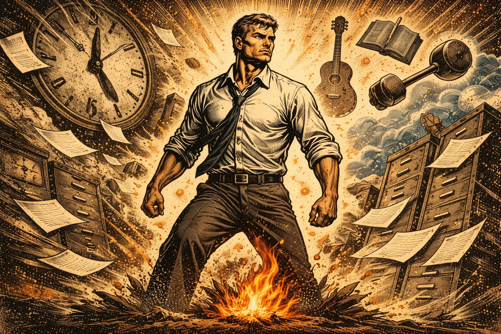
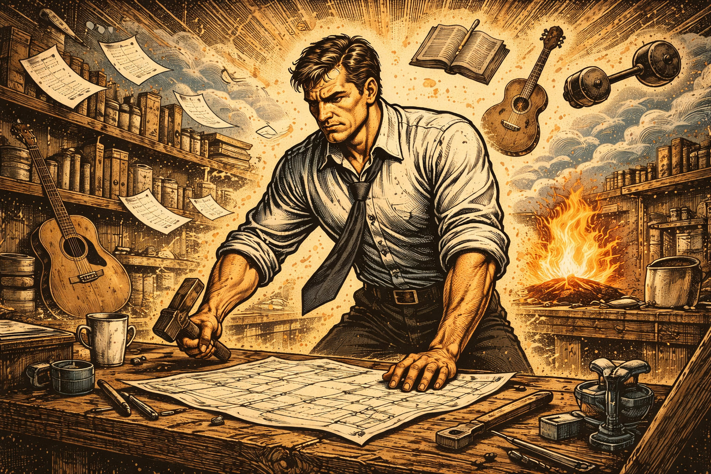

There is a certain kind of exhaustion that sleep does not fix.

It shows up on a Tuesday afternoon, somewhere between the third meeting and the fifth email thread. A man sits at his desk, moves tasks from one column to another, answers what needs answering, and tells himself he is making progress. Nothing is collapsing. Bills are paid. Deadlines are met. From the outside, it looks stable.

But inside, something feels dim.

He remembers a time when hours disappeared because he was building something, learning something, competing at something. He used to stay up late sketching plans, reading about obscure topics, practicing a skill no one asked him to master. Now he checks the clock.

The strange part is that he cannot point to a single failure. Life did not implode. It simply cooled.

## Why Discipline Fails Without Fire

We tend to explain this cooling as burnout, distraction, or lack of discipline. Those explanations are comforting because they suggest a technical fix. Improve time management. Reduce screen time. Add a morning routine. The assumption is that the structure is broken.

But the deeper issue is not structural. It is thermal.

A man does not stall because he lacks goals. He stalls because he has lost contact with what energizes him. Beneath the surface of productivity lies a primal force- passion. When that force fades, discipline becomes heavy, goals feel borrowed, and routines turn mechanical. The problem is not that men lack plans. It is that their internal heat has dropped below the level required to sustain effort.

This is not a matter of inspiration. It is a matter of fuel.

Without some form of genuine interest, curiosity, or drive, even the best designed system begins to feel like maintenance of a life rather than movement toward one. Passion is not a luxury added after success. It is the energy source that makes sustained effort possible in the first place.

## The Energy Beneath Achievement

Consider how skill develops in any field. A musician practices scales for years. An athlete repeats drills long after the thrill of novelty is gone. An entrepreneur studies markets, experiments, fails, and tries again. From the outside, this looks like discipline alone.

Yet discipline without attachment rarely lasts.

Psychologists have long noted the difference between intrinsic and extrinsic motivation. When effort is driven by internal interest, people persist longer and tolerate setbacks more effectively. When effort is driven only by reward or fear, compliance may occur, but resilience drops. The difference is subtle but decisive. One form of motivation pulls. The other pushes.

Culturally, many men are trained to respect only the push. Responsibility. Obligation. Provision. These are honorable forces. But when they crowd out personal interest, a quiet erosion begins. Work becomes something to endure rather than something to shape. Free time becomes recovery instead of engagement. Over time, the man who once explored and experimented becomes efficient but flat.

History offers a similar pattern. Movements, companies, even nations lose vitality not when they lack rules, but when they lose animating purpose. Structure can preserve order, but only purpose generates momentum. On the individual level, passion plays the role of that purpose. It is the internal signal that something matters enough to pursue.

When a man reconnects with an activity that absorbs him, whether it is coaching, woodworking, studying history, coding, training, writing, or building, something shifts. Energy increases. Attention sharpens. The same day that felt heavy gains a point of traction. The hour spent in genuine engagement often spills into improved performance elsewhere. Not because life became easier, but because it became warmer.

Passion does not solve every problem. It changes the temperature at which problems are faced.

## The Myth of Practicality

There is, however, a powerful counterargument. Passion, some will say, is indulgent. Adulthood is not about chasing interests. It is about duty. To emphasize personal enthusiasm risks irresponsibility. Better to focus on what pays, what is required, what is realistic.

This objection carries weight. Many men have seen others drift into fantasy, abandoning obligations in the name of self discovery. The fear of becoming unserious pushes them to suppress their own interests.

But this objection confuses excess with presence.

The claim here is not that passion replaces responsibility. It is that responsibility without passion corrodes from within. Ignoring what energizes you does not make you more disciplined. It makes you more brittle. Over time, the absence of internal fuel leads to quiet disengagement, the kind that shows up as distraction, irritability, or restless scrolling late at night.

Moreover, engaging a passion does not require abandoning work or family. It often requires only an hour of deliberate focus. A scheduled block. A protected window. The effect is disproportionate to the time invested. That hour functions less as entertainment and more as ignition. It reminds a man that he is not merely managing life. He is shaping it.

Practicality, in this sense, includes tending the source of one’s energy. A machine that runs without maintenance will eventually fail. A life that runs without enthusiasm will eventually stall.

## Restoring Heat

The cooling described at the beginning is not inevitable. It is gradual and often unnoticed until it has already taken hold. But it can be reversed.

Men stall not because they lack discipline, but because they have lost contact with what energizes them. Passion is the internal heat that makes effort sustainable and direction meaningful. When it is neglected, life becomes a sequence of obligations. When it is restored, those same obligations are carried with greater force.

This reframes how we think about progress. Instead of asking only what goals to set or what habits to install, the quwstion becomes _what genuinely engages me? Where do I lose track of time? What topic, craft, or challenge makes me lean forward rather than check out?_

The answers to those questions are not trivial. They are diagnostic.

In a culture that prizes productivity above all, reclaiming passion may seem secondary. It is not. It is foundational. A disciplined life without heat may function, but it will not forge anything lasting. A disciplined life with heat moves differently. It advances with intention rather than inertia.

The man at his desk on Tuesday afternoon does not need a more elaborate planner. He needs a reason to feel alive inside his own schedule.

Without fire, discipline fails.

With it, the same structure becomes a forge.
