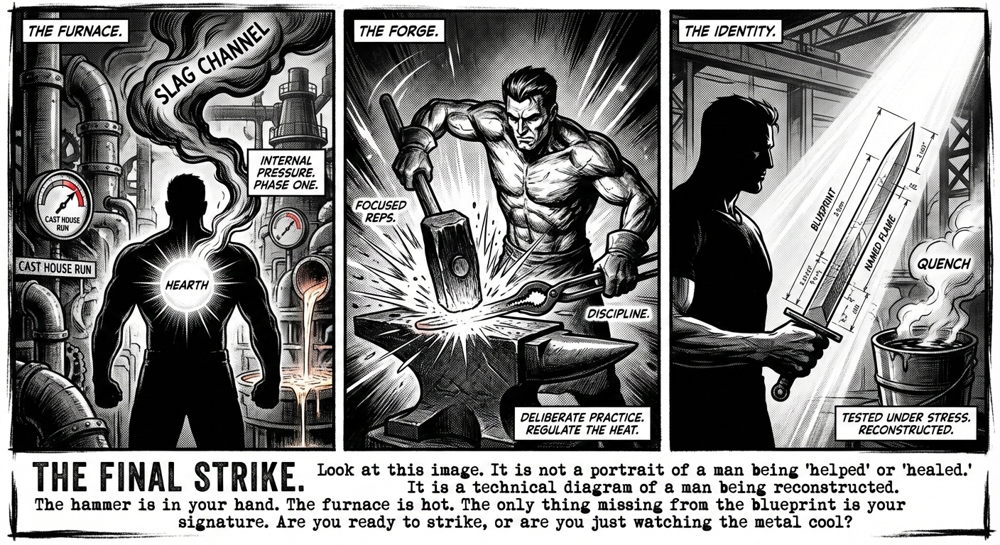

The modern man lives in a state of perpetual, low-grade exhaustion. We are surrounded by "optimization" culture—apps that track our sleep, podcasts that dictate our morning routines, and a relentless stream of content telling us to "hustle harder." Yet, for all this noise, the average man feels less like a sharpened blade and more like a piece of scrap metal: weathered by the elements, rusting from disuse, and lacking a clear edge. We are busy, but we are not moving. We are under pressure, but we are not being transformed by it. We are simply being crushed.

## The Failure of the Comfort Economy

This is the failure of the modern self-help industrial complex. It offers tips when we need a system; it offers comfort when we need a forge. To truly change, a man does not need more information. He needs a container for his effort. He needs a way to translate the crushing weight of his responsibilities into the heat required to reshape his very identity.

Transformation is a mechanical process, not a moral one. If you want to change the shape of steel, you do not talk to it or affirm it; you subject it to a specific sequence of heat, pressure, and impact. Your life is no different.

## Tired of Starting Strong & Stopping Early?

If you are already driven, capable, and self aware, but stuck in cycles of momentum and collapse, we will install the **3F Framework** and help you move forward without burnout, without white knuckling discipline, and without relying on hype that fades by week two.

This is not motivation.

It is infrastructure.

<!--
If you are ready to see exactly how this works, start by checking your **Ignition Score** to see how prepared you are to get real value from this workshop.

**Check Your Ignition Score** -->

## Men Are Frustrated by Their Inconsistency

Our best work has been with the men who do not need another planner, podcast, or pep talk. They needed a system that could hold their fire.

The 3F Framework has helped...

- Men who were stuck in stop-start cycles **finally choose one direction and commit to it**.

- Men who burned out every few months **build structure that made progress sustainable**.

- Men who worked hard but drifted **began producing consistent, visible results**.

The difference was never desire.

It was always structure.

<!--
Your Ignition Score will tell you whether this workshop solves the problem you are actually facing.

**Check Your Ignition Score** -->

## Moving Forward Can Feel Heavy

- You start strong, then lose momentum.
- You know what you should do, but struggle to follow through consistently.
- You set goals, then quietly abandon them when life applies pressure.

The problem is not your ambition.

The problem is that you are trying to sustain fire without a furnace.

**IGNITION** shows you a better way.

## How **IGNITION** works

### Step 1: Identify the Form

You clarify the single outcome that matters most right now.

You stop chasing ten goals and choose one edge.

You leave with direction instead of distraction.

### Step 2: Navigate the Forge

You learn how real transformation happens under pressure.

You identify where you are breaking, avoiding, or overheating.

You replace self criticism with a clear process for growth.

### Step 3: Install the Furnace

You build the structure that holds your fire.

You design daily inputs, boundaries, and outputs that create consistency.

You leave with a one page Furnace Blueprint you can actually live inside.

**Together, these three steps move you from repeated false starts to sustainable forward motion.**

<!-- Before you decide, check your Ignition Score to see how aligned this workshop is with where you are right now.

**Check Your Ignition Score** -->

## Why This Works

**IGNITION** works because it is built around how men actually change, not how they wish they did.

**Reason 1: Process Over Motivation**

You are taught how to work with pressure instead of fighting it. Progress becomes repeatable.

**Reason 2: Structure Beats Willpower**

You build systems that remove decision fatigue and prevent burnout before it starts.

**Reason 3: Commitment Through Community**

Momentum lasts longer when it is witnessed. You do not do this alone.

## Who This Is For

- Men who are capable but inconsistent.
- Men who want results, not inspiration.
- Men willing to take responsibility for their fire.

## Who This Is Not For

- Men looking for hype or shortcuts.
- Men unwilling to examine their patterns.
- Men who want motivation without structure.

<!-- Before you register or commit, the next step is simple.

Take the **Ignition Score Assessment**.

This will:

1. Diagnose where your momentum is breaking down.
2. Reveal whether your issue is clarity, process, or structure.
3. Show you exactly how effective this workshop will be for you.

If you are ready to stop restarting and finally build something that holds,

**Check Your Ignition Score** -->

## The Choice of the Anvil

The door to the forge is heavy, and it is not open to everyone. This is a collective for those ready to stop leaking energy and start building heat. You have spent years with scrap metal, reacting to the world as it hits you. You can continue to let the environment dictate your shape, or you can step into the furnace and decide who you are meant to be.

The fire is ready.

The question is whether you have the discipline to stand the heat, or if you prefer to stay exactly as you are. The choice, as always, is yours.

But the clock is ticking, and the metal is getting cold.

**Ready to stop starting over?**

If you know it’s time to choose your blade, face the fire, and build what holds...

Just reach out with 👉 **I’m IN**

That’s it. No forms. No fluff. Say it, and we begin.

Talk soon,
Dave Mainville
Founder, IGNITION

> “Fire is not the problem. What you build to hold it is.”
